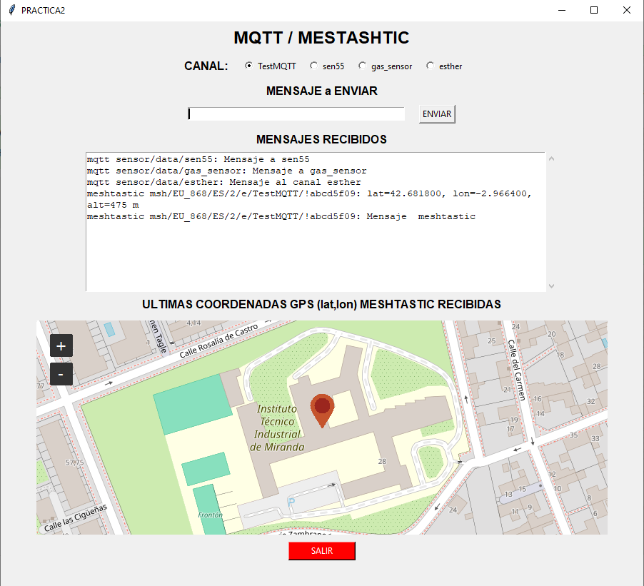

# PRAC02-POO: Comunicación al Fin del Mundo: MQTT & Meshtastic

En este repositorio hay una aplicación en Python que permite interactuar con dispositivos **Meshtastic** y **MQTT** desde la línea de comando. También envía, muestra mensajes y una ubicación en una **interfaz gráfica** basada en **Tkinter** y con un mapa interactivo **TkinterMapView**.

---

## Funcionalidades

- Enviar y recibir mensajes MQTT/Meshtastic desde la línea de comando con el programa **supervivencia.py**. Se puede ejecutar varias veces, en distintos terminales, por ejemplo en una para recibir mensajes MQTT, en otra para recibir mensajes Meshtastic, en otra para enviar un mensaje MQTT, en otra para enviar un mensaje Meshtastic, etc.
- Enviar y recibir mensajes MQTT/Meshtastic desde una interfaz gráfica con el programa **igrafica.py**:
- Los  mensajes se muestran en un área de texto no editable
- Las últimas coordenadas GPS recibidas se señalan en un mapa zoom(18) centrado en dichas coordenadas. Se pone un marcador típico y no cambia hasta las próximas coordenadas que se reciban.
- Elección de canal al que enviar mensajes a través de radio buttons
- Botón "SALIR" para cerrar la aplicación correctamente, de manera ordenada, terminando también los hilos que hacen las conexiones a los brokers. 

---

## Requisitos

- Se ha usado Python 3.13
- Paquetes de Python listados en `REQUIREMENTS.txt`

- Contenido de `REQUIREMENTS.txt`:
paho-mqtt==2.1.0
cryptography==46.0.2
meshtastic==2.7.3
tkintermapview==1.23

---

## Instalación

1. Clonar este repositorio
2. Instalar dependencias concretadas en el fichero requirements.txt
3. Usar

### Uso

*Ejecutar la interfaz gráfica*: 
- py igrafica.py
La ventana gráfica permite:
1. Seleccionar un canal (TestMQTT, sen55, gas_sensor, esther)
2. Escribir un mensaje y enviarlo
3. Visualizar los mensajes recibidos en tiempo real
4. Ver en el mapa con un marcador típico (globo) la última ubicación GPS recibida
5. Salir ordenadamente de la aplicación con el botón SALIR

*Ejecutar la interfaz de texto*
- python supervivencia.py --modo mqtt --enviar "SOS: no quedan provisiones" --canal esther
- python supervivencia.py --modo mqtt --enviar '{"MassConcentrationPm1p0":11.11,"MassConcentrationPm2p5":11.50,"MassConcentrationPm4p0":11.50,"MassConcentrationPm10p0":11.50,"AmbientHumidity":63.41,"AmbientTemperature":21.04,"VocIndex":76.00,"NoxIndex":1.00}' --canal sen55
- python supervivencia.py --modo mqtt --recibir
- python supervivencia.py --modo meshtastic --enviar "mensaje enviado por esther"
- python supervivencia.py --modo meshtastic  --recibir

### Archivos

01. cola_mensajes.py         # Cola de mensajes abstracta y concreta
02. comunicador.py           # Métodos para enviar y recibir mensajes (MQTT y Meshtastic)
03. datos.txt                # Fichero enel que se van añadiendo mensajes recibidos
04. dispositivo.py           # Implementa código MQTT/Meshtastic, atributos, mensajes...
05. excepciones.py           # Para definir excepciones personalizadas
06. igrafica.py              # Interfaz gráfica principal (PRÁCTICA 2)
07. interfazterminal.py      # Para la ejecución con la línea de comandos
08. LICENSE                  # Licencia GPL v3
09. multiple.py              # Clase Multiple (hereda de Cola y Utilidades)
10. README.md                # Este fichero
11. REQUIREMENTS.txt         # Fichero de dependencias de Python (librerias a instalar)
12. supervivencia.py         # Programa para ejecutar desde línea de comandos (PRÁCTICA 1)
13. utilidades.py            # Funciones auxiliares
14. ventana.png              # Imagen, captura de la ventana de la interfaz gráfica inicial
15. ventana2.png             # Imagen, captura de la ventana de la interfaz gráfica durante la ejecución

### Notas
1. Para asegurar que los hilos de MQTT y Meshtastic no bloqueen la interfaz, se han usado colas de mensajes y ventana.after() para procesarlos periódicamente.
2. Las coordenadas GPS se extraen mediante expresiones regulares desde los mensajes Meshtastic.
3. Se usa una excepción personalizada (ErrorDeConexion) para capturar errores de conexión o mensajes inválidos.
4. El botón SALIR detiene la GUI y luego los hilos de manera segura.

### Licencia
Este proyecto está bajo licencia GPL v3 para que sea libre y sus derivados también sean libres.
Consulta el archivo LICENSE para más detalles o el enlace https://www.gnu.org/licenses/gpl-3.0.txt

### Captura ventana interfaz gráfica
(ventana.png)

